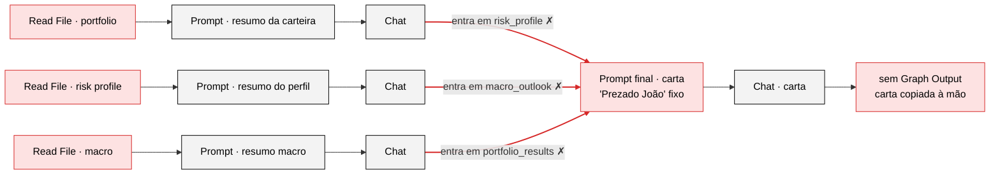

# Diagnóstico da primeira versão

A v1 é o arquivo `enter_challenge.rivet-project` (mantido intacto) e a carta `Output/output_letter.docx`. Os problemas se dividem em quatro grupos.

## A. Bugs no grafo do Rivet

Em vermelho, as ligações trocadas e os nós com problema: caminhos absolutos de outra máquina nos Read File, cliente fixo no prompt final e nenhuma saída do grafo. O grafo completo, como está no arquivo, aparece em **O trabalho › Grafos do Rivet** (aba v1).

| Problema | Evidência | Efeito |
|---|---|---|
| **Entradas trocadas no prompt final** | A saída do resumo da carteira vai para a porta `risk_profile`; a do perfil, para `macro_outlook`; a do macro, para `portfolio_results`. | Os três blocos chegam ao modelo com o rótulo errado, e a estrutura da carta depende de o modelo "adivinhar". |
| **Cliente errado** | O prompt final tem fixo: *"Prezado João, segue o relatório mensal…"*. | A carta saiu para João; o cliente é Albert da Silva. |
| **Arquivos lidos de caminhos absolutos de outra máquina** | `C:\Users\blope\Downloads\XP Challenge v2\Input\...`, com `errorOnMissingFile: false`. | Se o arquivo não existe, o prompt recebe texto vazio sem erro, e o modelo inventa o conteúdo. Os nomes nem batem (`Albert's` × `Albert_s`). |
| **Sem saída do grafo** | O último Chat não se conecta a nenhum Graph Output. | A carta foi copiada à mão para o Word. |
| **Parâmetros inadequados** | `temperature 0.5`, `maxTokens 1024`, gpt-4o-mini em tudo. | Temperatura alta para texto factual; o limite de tokens pode cortar uma carta de 500 palavras. |

## B. A carta afirma coisas falsas

| Afirmação da v1 | O que os dados dizem |
|---|---|
| "retorno total de 3,5%, ligeiramente abaixo do benchmark… 0,2 pontos percentuais" | Nenhum input traz retorno mensal nem benchmark. Os números foram inventados, seguindo o exemplo do prompt ("1.2% in May, outperforming its benchmark by 0.4 pp"). |
| "fundos… alcançaram um retorno de 17,4%" | Número inexistente. Os fundos só trazem rentabilidade desde a aplicação. |
| "Fed deve iniciar cortes em julho… Selic deve se estabilizar em 9%… inflação de 4,0% para 2025… R$/US$ 4,70" | O relatório da XP diz: **sem cortes do Fed em 2025, Selic terminal de 15,50%, IPCA de 6,1% e câmbio de 6,20.** |
| "HAPV3 e ARZZ3 apresentaram quedas significativas" | Isso é a rentabilidade desde a compra. No mês, HAPV3 **subiu 76%**, e quem caiu foi MRFG3 (−16%). |
| "Neste mês, optamos por não realizar realocações significativas" | Ação que não aconteceu, copiada do exemplo do prompt. |
| "contribuição firme do CDB Banco C6" | O CDB **venceu em 05/09/2024**, oito meses antes do extrato. |
| "recomendamos que você continue diversificando" | Genérico: nenhum ativo, nenhum valor, nenhuma ligação com o research ou com o perfil. |

## C. Problemas nos dados que ninguém sinalizou

- **Caixa parado:** R$ 74.672,62 em saldo disponível mais o CDB vencido (R$ 40.478,75) somam 29,8% do patrimônio sem render, com a Selic caminhando para 15,50%.
- **Datas que não conversam:** cotas dos fundos de 04/04/2024, extrato de 07/05/2025, relatório macro de 06/02/2025.
- **Ativos desatualizados:** ARZZ3 virou AZZA3 (fusão Arezzo + Soma, 2024). O "Brave I FIC FIM CP" virou "Brave 90 FIC FIDC" em 05/11/2024, e como FIDC não publica cota diária.
- **Carteira fora do perfil moderado:** HAPV3 e MRFG3 não são pagadoras consistentes de dividendos, como o perfil pede. 43,6% do patrimônio está em crédito privado, sem checagem do rating mínimo BB+ que o perfil exige.
- **Planilha de rentabilidade quebrada** (`profitability_calc_wip.xlsx`): o formato regional transformou números em datas ("22.9" virou 22/set, "13.5" virou 13/mai). A fórmula só existe em 4 linhas, não pondera pelas posições e não tem benchmark. O CSV equivalente tem os valores corretos e mais 8 ações que o Albert não tem.

## D. Problemas de arquitetura

- **Macro refeito para cada cliente:** o mesmo relatório é resumido de novo a cada carta. Isso gera custo repetido e dá a cada cliente uma leitura diferente do mesmo cenário.
- **Números em texto livre:** os números passam por dois LLMs como texto, e cada passagem é uma chance de erro.
- **Nenhuma validação:** a suíte de testes do Rivet (`testSuites: []`) está vazia, e não há nenhuma checagem entre as etapas.
