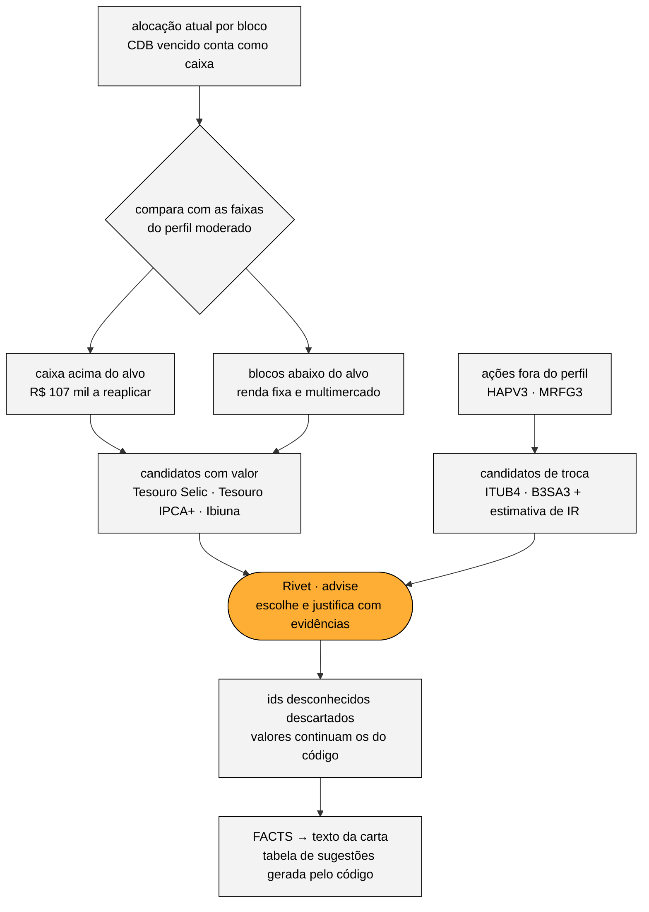

# Melhorias implementadas

O desafio sugeria três áreas e pedia pelo menos uma. As três foram implementadas, com a rentabilidade no centro, porque é dela que vêm os números que a v1 inventava. Cada área abaixo segue a mesma ordem: o pedido do desafio, o que foi feito, como foi implementado e o resultado para o Albert.

## 1. Cálculo de rentabilidade (Portfolio Profitability Calculation)

**Pedido:** calcular o retorno do último mês e ir além da conta básica, com dados externos, contexto ou elementos visuais.

**O que foi feito:**
- **Retorno do período por ativo, por classe e da carteira**, com o resultado em reais e a contribuição de cada ativo em pontos percentuais.
- **Ações:** quantidade (do extrato) × preço atual e do mês anterior (do CSV). O cálculo é exato; o teste confere +3,30% e +R$ 1.925,97.
- **Fundos:** o extrato só traz a rentabilidade desde a aplicação, e com cotas de abril de 2024. O retorno do mês vem das **cotas diárias oficiais da CVM**, na mesma janela das ações. Seis dos sete fundos têm cota diária. O Brave virou FIDC e não tem, então o retorno dele é uma estimativa pro rata do informe mensal da CVM, marcada como estimativa no brief.
- **CDB C6:** venceu em 2024, então fica fora do cálculo do mês e vira um alerta.
- **Benchmarks da mesma janela:** CDI (+1,00%) e IPCA em 12 meses (5,48%) do Banco Central, e Ibovespa (+6,22%) do Yahoo Finance.
- **Contexto de longo prazo:** resultado desde a aplicação por classe. Ações −38,74%, fundos +11,15%, renda fixa +34,93%.
- **Visual:** caixas de indicadores, um gráfico da carteira contra CDI e Ibovespa e a tabela "sua alocação × faixa do perfil".

**Como:**
- `returns.py` faz os cálculos;
- `funds.py` busca as cotas na CVM;
- `benchmarks.py` busca CDI, IPCA e Ibovespa;
- `charts.py` desenha o gráfico;
- `facts.py` formata tudo em pt-BR.

Nenhum desses números passa por um LLM.

**Resultado:** a carteira de ações e fundos (87% do investido) rendeu **+2,51% (+R$ 6.650,04)**. Isso é acima do CDI (+1,51 p.p.) e abaixo do Ibovespa, que se recuperou forte depois da queda de 7 de abril. Os destaques foram HAPV3 (+76,44%) e LREN3 (+8,94%); o detrator foi MRFG3 (−16,38%).

## 2. Lógica de compra e venda (Buy/Sell Recommendation Logic)

**Pedido:** um módulo que recomende quais ativos o cliente deveria considerar comprar ou vender.

**O que foi feito:** um motor em duas camadas.
1. **Regras em Python (`suitability.py`) decidem o quê e quanto.**
   - Classificam cada posição num bloco (renda fixa, multimercado, renda variável, caixa) e comparam com as faixas do perfil moderado (`config/allocation_moderate.yaml`).
   - O caixa acima do alvo é distribuído nas classes abaixo do alvo, com arredondamento em R$ 1.000.
   - Ações fora do perfil viram candidatas à troca por pagadoras de dividendos (`config/research_shelf.yaml`).
   - As regras também estimam o IR da venda: isenção de R$ 20 mil por mês e compensação entre prejuízo e ganho.
2. **O LLM (grafo `advise`) escolhe e explica.** Ele recebe os candidatos, o perfil e o resumo macro, monta 2 ou 3 recomendações e justifica cada uma citando os IDs das evidências do relatório (P1, T2…). Ele não pode criar ativo nem mudar valor: ids desconhecidos são descartados pelo código.

**Resultado para o Albert:**

| Sugestão | Movimento | Valor |
|---|---|---|
| Reinvestir o caixa em renda fixa e inflação | Aplicar em Tesouro Selic 2029 | R$ 40.000,00 |
| | Aplicar em Tesouro IPCA+ 2029 | R$ 40.000,00 |
| Diversificar com multimercado | Aplicar em Ibiuna Hedge ST | R$ 27.000,00 |
| Trocar ações fora do perfil | Vender MRFG3 e HAPV3; comprar ITUB4 e B3SA3 | R$ 15.431,04 + R$ 6.141,59 → R$ 10.000,00 + R$ 10.000,00 |

O brief do assessor também mostra a estimativa de IR. As vendas somam R$ 21.572,63 e passam da isenção, mas o prejuízo de HAPV3 (−R$ 18.022,55) supera o ganho de MRFG3 (+R$ 4.677,44). Não há IR a pagar, e sobra um prejuízo de R$ 13.345,11 para compensar no futuro.

**Limitação assumida:** as faixas do perfil e a lista de produtos são ilustrativas e estão marcadas assim nos arquivos. Em produção, viriam da carteira recomendada oficial do XP Research.

## 3. Formatação automática (Automated Formatting)

**Pedido:** gerar programaticamente uma carta com aparência profissional, pronta para enviar, sem edição manual.

**O que foi feito:** `render.py` monta o DOCX inteiro por código (python-docx):
- cabeçalho, data, destinatário e assunto;
- o texto da carta, em parágrafos;
- as caixas de indicadores e o gráfico;
- a tabela de alocação e a tabela de sugestões;
- a observação operacional e a assinatura do assessor;
- o disclaimer de suitability no rodapé.

O PDF é gerado abrindo uma instância separada do Word. Em seguida o código conta as páginas; se passar de duas, a carta é reescrita com um limite menor de palavras.

**Por que DOCX e PDF:** o PDF vai para o cliente. O DOCX fica com o assessor, que pode ajustar antes do envio: é o humano no loop.

## Outras melhorias que foram necessárias

- **Extração do extrato com validação:** o PDF vira JSON via LLM, e o código confere se tudo fecha.
- **Macro calculado uma vez por mês**, com cada afirmação ancorada numa citação literal do relatório.
- **Fact-check numérico da carta** e um **revisor de fidelidade** (6º grafo), com até três versões.
- **Frases sensíveis escritas pelo código**, como a nota sobre a liquidação do CDB.
- **Brief do assessor** com 11 alertas de dados, evidências e custo.
- **Cache e reprodutibilidade:** a mesma entrada gera a mesma carta sem gastar tokens de novo.

O detalhe de cada uma está em [Qualidade e travas](06_qualidade_e_travas.md).
