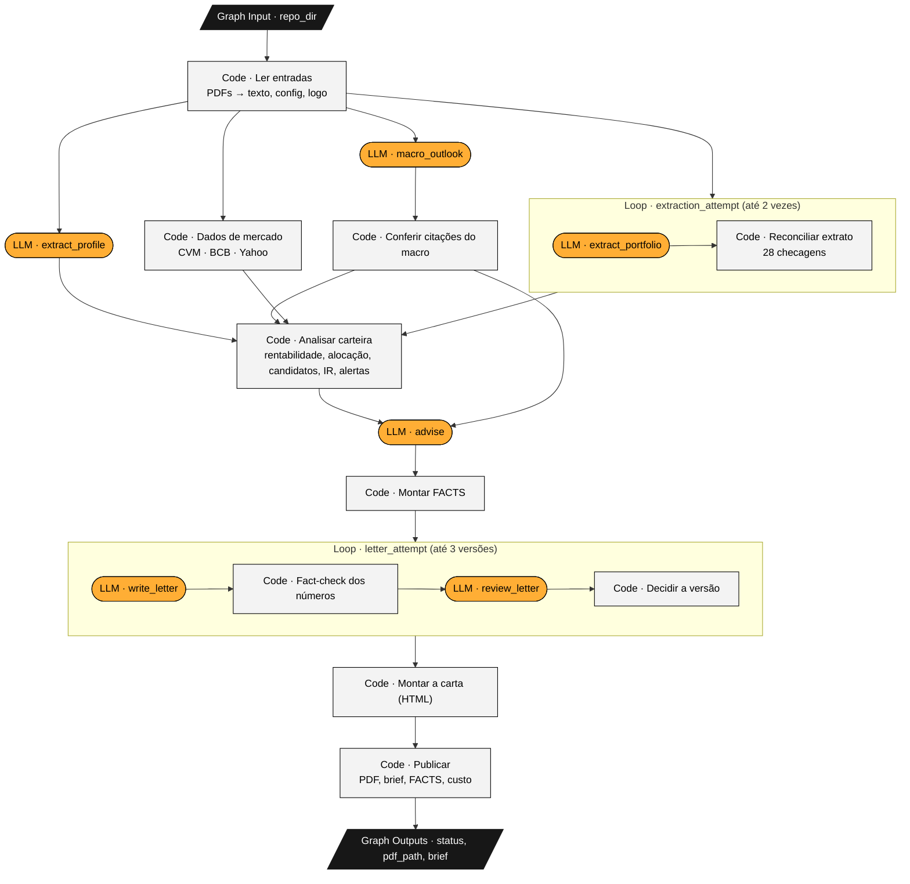
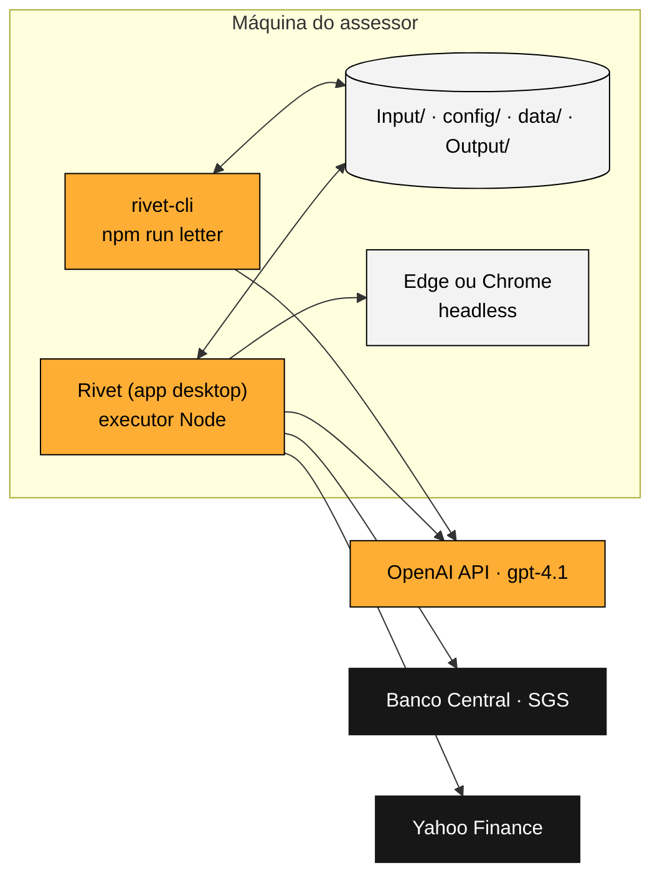
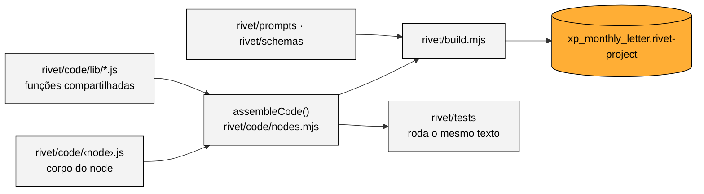
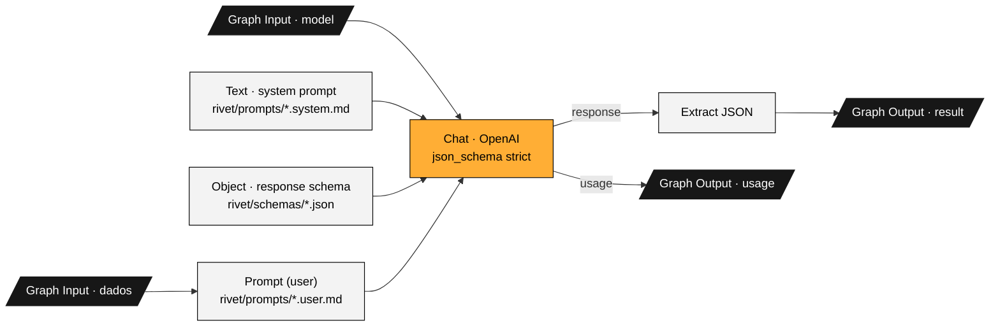

# Arquitetura e código

## O grafo `monthly_letter`

Tudo roda num único grafo do Rivet. Ele recebe só a pasta do projeto (`repo_dir`) e termina com o PDF da carta em `Output/`.



Em laranja, os grafos de LLM; em cinza, os nodes de código; em preto, a entrada e as saídas do grafo. As três chamadas depois de **Ler entradas** (extração, perfil e macro) e os **Dados de mercado** rodam em paralelo.

O projeto tem 9 grafos:

| Grafo | Papel |
|---|---|
| `monthly_letter` | O grafo principal: 16 nodes, do input ao PDF |
| `extraction_attempt` | Corpo do primeiro loop: chama `extract_portfolio` e reconcilia o resultado |
| `letter_attempt` | Corpo do segundo loop: escreve, confere os números, revisa e decide se a versão serve |
| `extract_portfolio`, `extract_profile`, `macro_outlook`, `advise`, `write_letter`, `review_letter` | Os 6 grafos de LLM, todos no mesmo formato (abaixo) |

Os dois loops usam o node **Loop Until** do Rivet: ele roda o subgrafo, confere a saída `done` e, se ela não for `"true"`, roda de novo passando as saídas da volta anterior (as correções e o log de tokens) como entradas da próxima.

## Onde cada peça roda



O mesmo projeto roda no app do Rivet (com o executor Node) ou no terminal pelo `rivet-cli`. O CLI faz as mesmas chamadas que o app (BCB, Yahoo, navegador); o diagrama mostra só as do app para não repetir as setas. As cotas da CVM não são baixadas na execução: o recorte usado está em `data/market/`.

## Por que tudo no Rivet

**Visibilidade.** O fluxo inteiro fica num lugar só: abrir o `monthly_letter` no app mostra cada etapa, e ao rodar cada node acende com a entrada e a saída que recebeu. Quem mantém o workflow, e usa Rivet no dia a dia, lê o processo sem abrir outra ferramenta.

**O que isso custou:**
- **Code nodes só rodam JavaScript.** As contas e regras foram escritas em JavaScript e conferidas contra a versão Python da branch `main`: os FACTS saem idênticos, e um teste garante isso.
- **Code nodes não importam módulos.** O código fica em arquivos: um por node em `rivet/code/` e as funções compartilhadas em `rivet/code/lib/`. O `rivet/build.mjs` cola as bibliotecas de cada node antes do corpo e grava o projeto. Editar o código dentro do app não adianta, porque o próximo build sobrescreve.
- **Ler e escrever arquivos exige o executor Node.** No app, esse executor roda Node 18 e quebra quando um Code node marca *Allow require*, com o erro "The argument 'filename' … Received undefined". Os nodes carregam os módulos por `projectRequire()` (`lib/modules.js`), que funciona no app e no CLI.
- **O Rivet não escreve arquivos nem gera DOCX, e o node Chat da OpenAI não recebe PDF.** Por isso a leitura dos PDFs (pdf.js) e a gravação das saídas são nodes de código, e a carta é HTML impresso em PDF pelo navegador.

## Como o código dos nodes é organizado



`rivet/code/nodes.mjs` é o catálogo: para cada node, as bibliotecas, as portas de entrada e saída e as permissões do executor. A mesma função `assembleCode()` monta o código que vai para o projeto e o código que os testes executam, então o que é testado é exatamente o que roda no Rivet.

Os 10 nodes de código:

| Node | Arquivo | Faz |
|---|---|---|
| Ler entradas | `load_inputs.js` | Lê o `settings.yaml`, extrai o texto dos PDFs, carrega faixas, prateleira, fundos e o logo |
| Dados de mercado | `market_data.js` | Preços do CSV, retorno dos fundos pela CVM, CDI, IPCA e Ibovespa ao vivo (com arquivo salvo se a rede falhar) |
| Reconciliar extrato | `reconcile.js` | 28 checagens do JSON transcrito; o que falhar vira correção para a próxima volta do loop |
| Conferir citações do macro | `ground_macro.js` | Mantém só o que tem citação e números encontrados no relatório |
| Analisar carteira | `analyze.js` | Rentabilidade, alocação × perfil, candidatos de compra e venda, IR e alertas de dados |
| Montar FACTS | `build_facts.js` | Junta a escolha do `advise` aos candidatos e monta o bloco de números da carta |
| Fact-check dos números | `check_numbers.js` | Todo %, R$ e p.p. da carta tem de estar nos FACTS |
| Decidir a versão | `decide_letter.js` | Junta fact-check, revisor e limite de palavras; decide se o loop termina |
| Montar a carta (HTML) | `render_letter.js` | Carta em HTML com a identidade da XP, duas folhas A4 |
| Publicar | `publish.js` | PDF pelo navegador, contagem de páginas, status, brief, FACTS e log de custo |

As bibliotecas (`rivet/code/lib/`):

| Biblioteca | Faz | Usada por |
|---|---|---|
| `io.js` | Lê as portas de entrada e empacota as saídas no formato do Rivet | todos |
| `modules.js` | Carrega módulos do Node sem o *require* do Rivet | Ler entradas, Dados de mercado, Publicar |
| `format.js` | Formatação pt-BR de R$, %, p.p. e datas; o fact-check depende de um formato único | quase todos |
| `pdf.js` | PDF → texto, uma linha por linha de tabela | Ler entradas |
| `market.js` | CSV de preços, cotas da CVM, BCB e Yahoo | Dados de mercado |
| `portfolio.js` | Modelo do extrato e reconciliação | Reconciliar, Analisar, Montar FACTS, Publicar |
| `returns.js` | Rentabilidade do período e desde a aplicação | Analisar, Montar FACTS, Montar a carta |
| `suitability.js` | Alocação × faixas, candidatos, IR | Analisar, Montar FACTS, Montar a carta, Publicar |
| `quality.js` | Os alertas de dados do brief | Analisar |
| `grounding.js` | Confere as citações do macro | Conferir citações |
| `factcheck.js` | Extrai e confere os números da carta | Conferir citações, Fact-check, Decidir |
| `facts.js` | Monta o bloco FACTS | Montar FACTS, Montar a carta, Publicar |
| `letter_html.js` | HTML e gráfico SVG da carta | Montar a carta |
| `brief.js` | Brief do assessor em Markdown | Publicar |

## Os grafos de LLM



O mesmo formato vale para os seis grafos; muda só o prompt, o schema e as entradas. Cada grafo também roda sozinho no app: as entradas vêm preenchidas com dados reais do Albert (`data/rivet_inputs/`).

| Grafo | Modelo | Entrada | Saída |
|---|---|---|---|
| `extract_portfolio` | gpt-4.1 | texto do extrato (+ correções) | JSON do extrato (12 posições, subtotais, totais) |
| `extract_profile` | gpt-4.1 | perfil de risco | perfil, horizonte, tolerância, produtos elegíveis, rating mínimo |
| `macro_outlook` | gpt-4.1 | relatório macro | projeções, temas, riscos (cada um com citação) e implicações |
| `advise` | gpt-4.1 | perfil, alocação, candidatos, macro | 2–3 recomendações com justificativa e IDs de evidência |
| `write_letter` | gpt-4.1 | FACTS, limite de palavras, correções | assunto, saudação e quatro parágrafos |
| `review_letter` | gpt-4.1 | FACTS e carta | apontamentos graves e leves |

**Por que gpt-4.1 e não gpt-5:** o Rivet 1.25 só trata como "modelo de raciocínio" os nomes que começam com o1, o3 ou o4. Com um gpt-5, ele enviaria `temperature` e `max_tokens`, que a API rejeita.

**Por que não o gpt-4.1-mini na extração:** ele trocou dois dígitos de um subtotal e repetiu o erro mesmo recebendo o aviso (a prova está em `data/evidence/`).

## Estrutura do repositório

```
config/         cliente, período, modelos, preços por token, limites, logo, navegadores do PDF,
                faixas do perfil, produtos e fundos (CNPJ)
data/           market/ (cotas da CVM e benchmarks salvos), rivet_inputs/ (entradas padrão), evidence/
docs/           esta documentação, o relatório de 2 páginas, o site index.html e o gerador em site/
Input/          arquivos do desafio (intactos) e o logo da XP
Output/         carta (HTML e PDF), brief, FACTS e log de custo; a carta da v1 continua aqui
rivet/          xp_monthly_letter.rivet-project, build.mjs, code/, prompts/, schemas/, tests/
enter_challenge.rivet-project   grafo da v1, intacto para comparação
```
