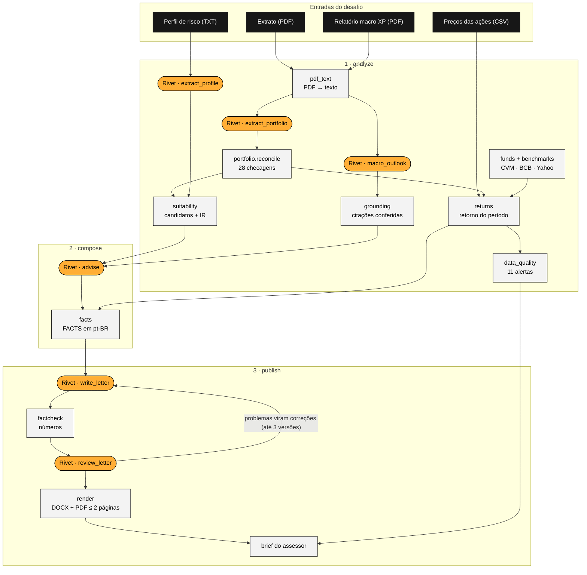
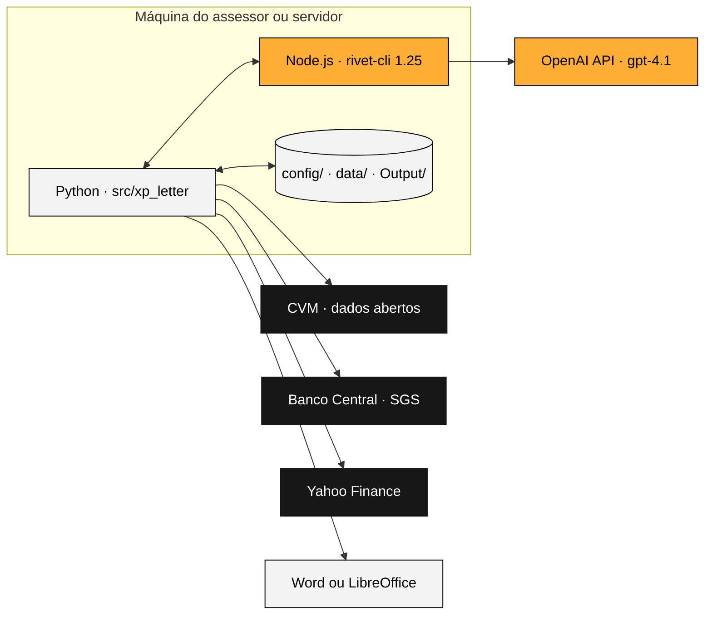
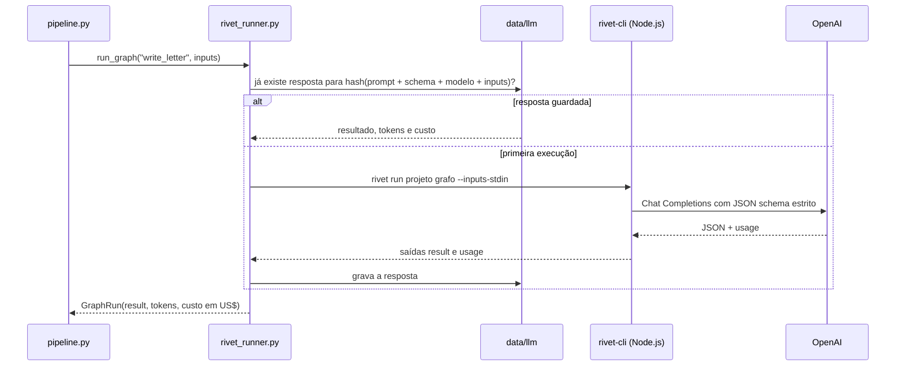
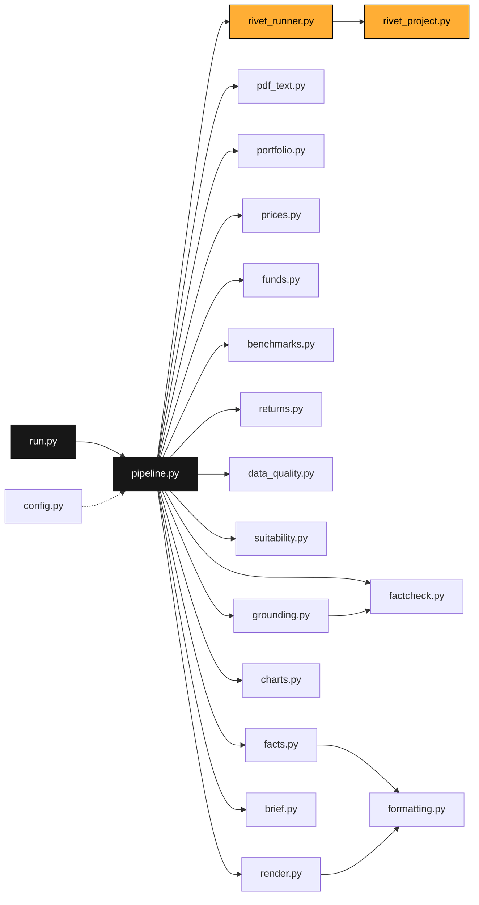
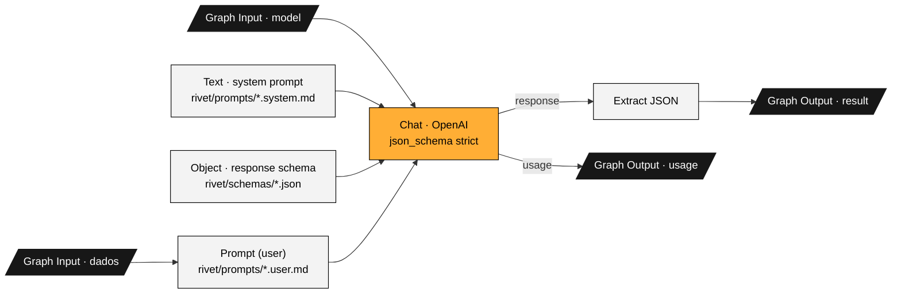

# Arquitetura e código

## O fluxo



Em laranja, os grafos do Rivet (LLM); em cinza, o código Python determinístico; em preto, as entradas.

## Onde cada peça roda



## Por que Rivet e Python juntos

**O Rivet ficou com as etapas de LLM**, porque é a ferramenta do desafio e da equipe. Os seis grafos seguem o mesmo desenho, fácil de ler no app: entradas → prompt → Chat da OpenAI com JSON schema estrito → Extract JSON → saídas `result` e `usage`. Os prompts e schemas ficam em arquivos de texto revisáveis (`rivet/prompts`, `rivet/schemas`), e `src/build_rivet.py` monta o projeto a partir deles.

**O Python ficou com o que precisa estar certo sempre:** contas, regras, checagens e formatação. Isso até daria para fazer em nodes de código do Rivet, mas em Python é testável (29 testes rodando em 5 segundos, sem API), versionável e mais fácil de manter.

**A ligação entre os dois** é o `rivet_runner.py`, que chama cada grafo pelo `rivet-cli` oficial, passa os inputs em JSON e lê o resultado. Cada resposta fica guardada em `data/llm/`, identificada por um hash do prompt, do schema, do modelo e dos inputs.



## Por que vários arquivos Python

Cada módulo tem **uma responsabilidade**. Isso permite testar cada peça isoladamente e trocar uma sem mexer nas outras. Por exemplo, a fonte de cotas pode trocar de CVM para ANBIMA mexendo só em `funds.py`. Também facilita a revisão: quem quer auditar o cálculo lê só `returns.py`.

| Módulo | Faz | Por que separado |
|---|---|---|
| `config.py` | Lê os YAML e resolve caminhos | Um único ponto para mudar cliente, período, modelos e limites |
| `pdf_text.py` | PDF → texto | A extração de PDF é trocável (por exemplo, pela API de posições da XP) |
| `portfolio.py` | Modelo do extrato e reconciliação | A trava que decide se o dado extraído pelo LLM é confiável |
| `prices.py` | Lê o CSV de preços | A fonte de preços é trocável |
| `funds.py` | Cotas da CVM → retorno dos fundos | Dependência externa isolada, com cache |
| `benchmarks.py` | CDI, IPCA, Ibovespa | Dependência externa isolada, com cache |
| `returns.py` | Rentabilidade | O cálculo central, 100% testado |
| `data_quality.py` | Alertas de dados | Regras de negócio que crescem com o tempo |
| `suitability.py` | Alocação × perfil, candidatos, IR | A lógica de recomendação, auditável |
| `grounding.py` | Confere as citações do macro | Trava contra alucinação no macro |
| `facts.py` | Monta o bloco FACTS | O único lugar de onde a carta tira números |
| `factcheck.py` | Confere os números da carta | Trava determinística contra números inventados |
| `formatting.py` | Formatação pt-BR | Garante um formato único para cada número (o fact-check depende disso) |
| `rivet_project.py` | Gera o `.rivet-project` | O grafo nasce dos prompts e schemas versionados |
| `rivet_runner.py` | Executa grafos, guarda respostas, calcula custo | A ponte com o Rivet |
| `charts.py` | Gráfico | Visual separado do texto |
| `render.py` | DOCX e PDF | A formatação automática |
| `brief.py` | Brief do assessor | O documento de revisão humana |
| `pipeline.py` | Orquestra as três etapas (analyze, compose, publish) | Mostra o fluxo inteiro em um arquivo curto |

Quem chama quem:



## Os grafos do Rivet



O mesmo formato vale para os seis grafos; muda só o prompt, o schema e as entradas. Na seção **Grafos do Rivet**, logo abaixo, cada um aparece desenhado como no app.

| Grafo | Modelo | Entrada | Saída |
|---|---|---|---|
| `extract_portfolio` | gpt-4.1 | texto do extrato (+ correções) | JSON do extrato (12 posições, subtotais, totais) |
| `extract_profile` | gpt-4.1 | perfil de risco | perfil, horizonte, tolerância, produtos elegíveis, rating mínimo |
| `macro_outlook` | gpt-4.1 | relatório macro | projeções, temas, riscos (cada um com citação) e implicações |
| `advise` | gpt-4.1 | perfil, alocação, candidatos, macro | 2–3 recomendações com justificativa e IDs de evidência |
| `write_letter` | gpt-4.1 | FACTS, limite de palavras, correções | assunto, saudação e quatro parágrafos |
| `review_letter` | gpt-4.1 | FACTS e carta | apontamentos graves e leves |

**Por que gpt-4.1 e não gpt-5:** o Rivet 1.25 só trata como "modelo de raciocínio" os nomes que começam com o1, o3 ou o4. Com um gpt-5, ele enviaria `temperature` e `max_tokens`, que a API rejeita.

**Por que não o gpt-4.1-mini na extração:** ele trocou dois dígitos de um subtotal e repetiu o erro mesmo recebendo o aviso (a prova está em `data/evidence/`).

## Estrutura do repositório

```
config/         cliente, período, modelos, preços por token, faixas do perfil, produtos, fundos (CNPJ)
data/           llm/ (respostas guardadas), market/ (CVM e benchmarks), rivet_inputs/, evidence/
docs/           esta documentação, o relatório de 2 páginas e o site index.html
Input/          arquivos do desafio (intactos)
Output/         carta (DOCX/PDF), gráfico, brief, FACTS e log de custo; a carta da v1 continua aqui
rivet/          prompts/, schemas/ e o projeto xp_monthly_letter.rivet-project
src/            xp_letter/ (pacote), docsite/ (visualizador do Rivet), tests/, run.py, build_rivet.py,
                build_docs.py, build_report.py
assets/xp/      logo usado no cabeçalho da carta (caminho em config/settings.yaml → brand.logo)
enter_challenge.rivet-project   grafo da v1, intacto para comparação
```
