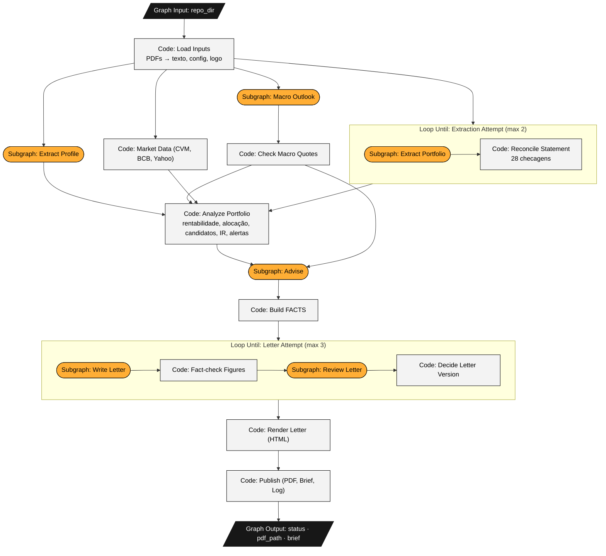
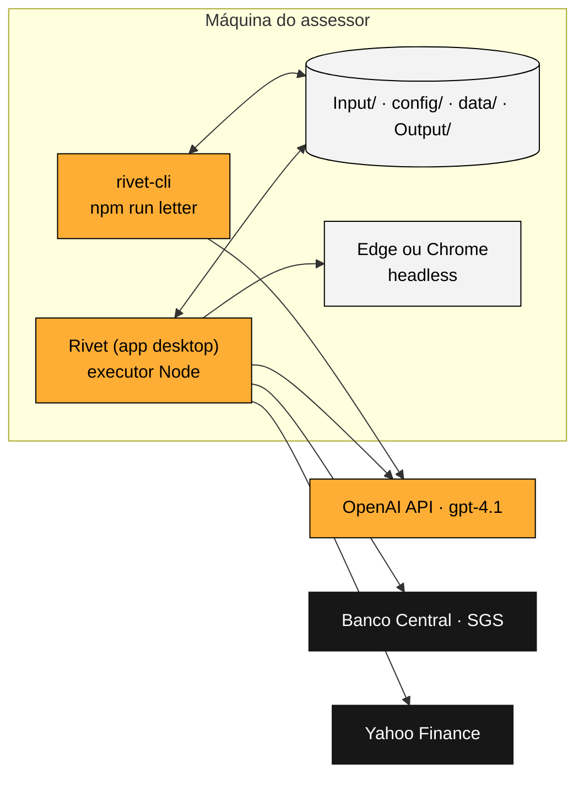
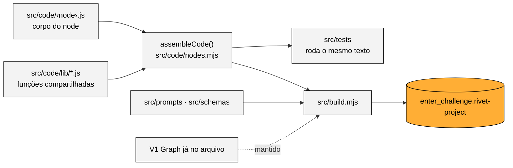
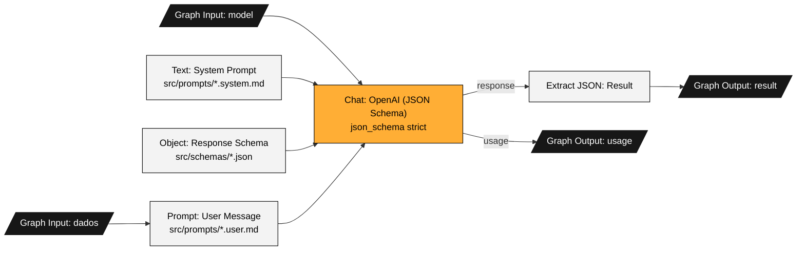

# Arquitetura e código

## O Main Graph

Tudo roda num único projeto do Rivet, o `enter_challenge.rivet-project` na raiz do repositório. O grafo principal é o **Main Graph: Enter Challenge**: ele recebe só a pasta do projeto (`repo_dir`) e termina com o PDF da carta em `Output/`. Os nomes abaixo são os títulos dos nodes como aparecem no app.



Em laranja, os subgrafos de LLM; em cinza, os Code nodes; em preto, a entrada e as saídas do grafo. Os dois blocos com borda são os nodes **Loop Until**, com o subgrafo que cada um repete. As três chamadas depois de **Code: Load Inputs** (extração, perfil e macro) e o **Code: Market Data** rodam em paralelo.

Na lateral do app, o projeto tem 10 grafos:

| Grafo (nome na lateral) | Papel |
|---|---|
| **Main Graph: Enter Challenge** | O grafo principal: 16 nodes, do input ao PDF |
| **Subgraph: Extraction Attempt (loop body)** | O que o **Loop Until: Extraction Attempt** repete: transcreve o extrato e reconcilia |
| **Subgraph: Letter Attempt (loop body)** | O que o **Loop Until: Letter Attempt** repete: escreve, confere os números, revisa e decide |
| **Subgraph: Extract Portfolio**, **Extract Profile**, **Macro Outlook**, **Advise**, **Write Letter**, **Review Letter** | Os 6 subgrafos de LLM, todos no mesmo formato (abaixo) |
| **V1 Graph: Original Challenge (unchanged)** | O grafo original do desafio, com os nodes intactos, para comparação. Não participa da execução |

O node **Loop Until** roda o subgrafo, confere a saída `done` e, se ela não for `"true"`, roda de novo passando as saídas da volta anterior (as correções e o log de tokens) como entradas da próxima.

## Onde cada peça roda



O mesmo projeto roda no app do Rivet (com o executor Node) ou no terminal pelo `rivet-cli`. O CLI faz as mesmas chamadas que o app (BCB, Yahoo, navegador); o diagrama mostra só as do app para não repetir as setas. As cotas da CVM não são baixadas na execução: o recorte usado está em `data/market/`.

## Por que tudo no Rivet

**Visibilidade.** O fluxo inteiro fica num lugar só: abrir o **Main Graph: Enter Challenge** no app mostra cada etapa, e ao rodar cada node acende com a entrada e a saída que recebeu. Quem mantém o workflow, e usa Rivet no dia a dia, lê o processo sem abrir outra ferramenta.

**O que isso custou:**
- **Code nodes só rodam JavaScript.** As contas e regras foram escritas em JavaScript e conferidas contra a versão Python da branch `main`: os FACTS saem idênticos, e um teste garante isso.
- **Code nodes não importam módulos.** O código fica em arquivos: um por node em `src/code/` e as funções compartilhadas em `src/code/lib/`. O `src/build.mjs` cola as bibliotecas de cada node antes do corpo e grava o projeto. Editar o código dentro do app não adianta, porque o próximo build sobrescreve.
- **Ler e escrever arquivos exige o executor Node.** No app, esse executor roda Node 18 e quebra quando um Code node marca *Allow require*, com o erro "The argument 'filename' … Received undefined". Os nodes carregam os módulos por `projectRequire()` (`lib/modules.js`), que funciona no app e no CLI.
- **O Rivet não escreve arquivos nem gera DOCX, e o node Chat da OpenAI não recebe PDF.** Por isso a leitura dos PDFs (pdf.js) e a gravação das saídas são Code nodes, e a carta é HTML impresso em PDF pelo navegador.

## Como o projeto é gerado



`src/code/nodes.mjs` é o catálogo: para cada node, o título, as bibliotecas, as portas de entrada e saída e as permissões do executor. A mesma função `assembleCode()` monta o código que vai para o projeto e o código que os testes executam, então o que é testado é exatamente o que roda no Rivet.

O `src/build.mjs` regrava o `enter_challenge.rivet-project` a cada build, mas mantém os grafos que ele não gera: é assim que o grafo original da v1 continua no arquivo. Todo título segue o padrão *tipo do node: nome* (`Graph Input: repo_dir`, `Code: Load Inputs`, `Subgraph: Advise`, `Loop Until: Letter Attempt (max 3)`), e cada grafo na lateral começa por *Main Graph*, *Subgraph* ou *V1 Graph*.

Os 10 Code nodes:

| Node | Arquivo | Faz |
|---|---|---|
| Code: Load Inputs | `load_inputs.js` | Lê o `settings.yaml`, extrai o texto dos PDFs, carrega faixas, prateleira, fundos e o logo |
| Code: Market Data (CVM, BCB, Yahoo) | `market_data.js` | Preços do CSV, retorno dos fundos pela CVM, CDI, IPCA e Ibovespa ao vivo (com arquivo salvo se a rede falhar) |
| Code: Reconcile Statement | `reconcile.js` | 28 checagens do JSON transcrito; o que falhar vira correção para a próxima volta do loop |
| Code: Check Macro Quotes | `ground_macro.js` | Mantém só o que tem citação e números encontrados no relatório |
| Code: Analyze Portfolio | `analyze.js` | Rentabilidade, alocação × perfil, candidatos de compra e venda, IR e alertas de dados |
| Code: Build FACTS | `build_facts.js` | Junta a escolha do Subgraph: Advise aos candidatos e monta o bloco de números da carta |
| Code: Fact-check Figures | `check_numbers.js` | Todo %, R$ e p.p. da carta tem de estar nos FACTS |
| Code: Decide Letter Version | `decide_letter.js` | Junta fact-check, revisor e limite de palavras; decide se o loop termina |
| Code: Render Letter (HTML) | `render_letter.js` | Carta em HTML com a identidade da XP, duas folhas A4 |
| Code: Publish (PDF, Brief, Log) | `publish.js` | PDF pelo navegador, contagem de páginas, status, brief, FACTS e log de custo |

As bibliotecas (`src/code/lib/`):

| Biblioteca | Faz | Usada por |
|---|---|---|
| `io.js` | Lê as portas de entrada e empacota as saídas no formato do Rivet | todos |
| `modules.js` | Carrega módulos do Node sem o *require* do Rivet | Load Inputs, Market Data, Publish |
| `format.js` | Formatação pt-BR de R$, %, p.p. e datas; o fact-check depende de um formato único | quase todos |
| `pdf.js` | PDF → texto, uma linha por linha de tabela | Load Inputs |
| `market.js` | CSV de preços, cotas da CVM, BCB e Yahoo | Market Data |
| `portfolio.js` | Modelo do extrato e reconciliação | Reconcile Statement, Analyze Portfolio, Build FACTS, Publish |
| `returns.js` | Rentabilidade do período e desde a aplicação | Analyze Portfolio, Build FACTS, Render Letter |
| `suitability.js` | Alocação × faixas, candidatos, IR | Analyze Portfolio, Build FACTS, Render Letter, Publish |
| `quality.js` | Os alertas de dados do brief | Analyze Portfolio |
| `grounding.js` | Confere as citações do macro | Check Macro Quotes |
| `factcheck.js` | Extrai e confere os números da carta | Check Macro Quotes, Fact-check Figures, Decide Letter Version |
| `facts.js` | Monta o bloco FACTS | Build FACTS, Render Letter, Publish |
| `letter_html.js` | HTML e gráfico SVG da carta | Render Letter |
| `brief.js` | Brief do assessor em Markdown | Publish |

## Os subgrafos de LLM



O mesmo formato vale para os seis; muda só o prompt, o schema e as entradas. Cada um também roda sozinho no app: as entradas vêm preenchidas com dados reais do Albert (`data/rivet_inputs/`).

| Subgrafo | Modelo | Entrada | Saída |
|---|---|---|---|
| Subgraph: Extract Portfolio | gpt-4.1 | texto do extrato (+ correções) | JSON do extrato (12 posições, subtotais, totais) |
| Subgraph: Extract Profile | gpt-4.1 | perfil de risco | perfil, horizonte, tolerância, produtos elegíveis, rating mínimo |
| Subgraph: Macro Outlook | gpt-4.1 | relatório macro | projeções, temas, riscos (cada um com citação) e implicações |
| Subgraph: Advise | gpt-4.1 | perfil, alocação, candidatos, macro | 2–3 recomendações com justificativa e IDs de evidência |
| Subgraph: Write Letter | gpt-4.1 | FACTS, limite de palavras, correções | assunto, saudação e quatro parágrafos |
| Subgraph: Review Letter | gpt-4.1 | FACTS e carta | apontamentos graves e leves |

**Por que gpt-4.1 e não gpt-5:** o Rivet 1.25 só trata como "modelo de raciocínio" os nomes que começam com o1, o3 ou o4. Com um gpt-5, ele enviaria `temperature` e `max_tokens`, que a API rejeita.

**Por que não o gpt-4.1-mini na extração:** ele trocou dois dígitos de um subtotal e repetiu o erro mesmo recebendo o aviso (a prova está em `data/evidence/`).

## Estrutura do repositório

```
enter_challenge.rivet-project   o projeto do Rivet: Main Graph, subgrafos e o V1 Graph original
src/            build.mjs (gera o projeto), code/ (Code nodes e lib/), prompts/, schemas/, tests/
config/         cliente, período, modelos, preços por token, limites, logo, navegadores do PDF,
                faixas do perfil, produtos e fundos (CNPJ)
data/           market/ (cotas da CVM e benchmarks salvos), rivet_inputs/ (entradas padrão), evidence/
docs/           esta documentação, o site index.html e o gerador em site/
Input/          arquivos do desafio (intactos) e o logo da XP
Output/         carta (HTML e PDF), brief, FACTS e log de custo; a carta da v1 continua aqui
```
