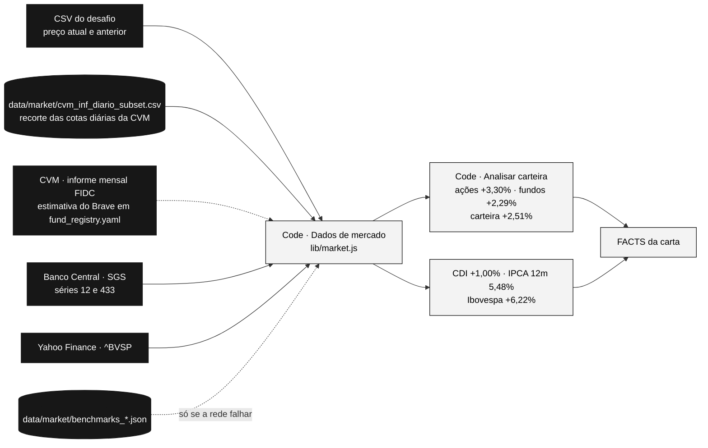

# Dados externos: por que e de onde

## O problema: os inputs não bastam para calcular o mês

O desafio pede o retorno do último mês, mas os arquivos entregues só permitem calcular isso para as ações:

| Classe | O que os inputs trazem | Dá para calcular o mês? |
|---|---|---|
| Ações (19% do investido) | Quantidade no extrato; preço atual e do mês anterior no CSV | **Sim** |
| Fundos (68%) | Só a rentabilidade *desde a aplicação*, com cota de **04/04/2024** | **Não**: falta a cota do início e do fim do mês |
| Renda fixa (13%) | Um CDB **vencido em 05/09/2024** | Não se aplica |
| Benchmark | Nada | **Não** |

Sem dados externos, a carta só poderia falar do mês de 19% da carteira e não teria com o que comparar. Foi exatamente essa lacuna que a v1 preencheu inventando números. O próprio enunciado sugere *"use external data sources"*.

## As fontes usadas

| Fonte | O que trouxe | Por que essa fonte |
|---|---|---|
| **CVM, dados abertos** (`dados.cvm.gov.br`, informe diário dos fundos) | Cota diária de cada fundo em 07/04/2025 e em 07/05/2025, e portanto o retorno do mês de 6 dos 7 fundos | É a fonte **oficial** e pública das cotas de fundos no Brasil, publicada pelo regulador |
| **Banco Central, SGS** (`api.bcb.gov.br`) | CDI diário (série 12), capitalizado no período; IPCA mensal (série 433) para o acumulado em 12 meses | É a fonte oficial do CDI e do IPCA, com API pública e gratuita |
| **Yahoo Finance** (`^BVSP`) | Fechamento do Ibovespa nas duas datas | O Banco Central parou de publicar o Ibovespa em 2019 (série 7). A B3, dona do índice, não oferece API gratuita de histórico, e o Yahoo é a fonte gratuita prática |

**Sobre a B3:** nenhum dado foi buscado diretamente na B3. O Ibovespa é um índice da B3, mas o histórico veio do Yahoo Finance pelo motivo acima. Em produção, a XP usaria o próprio feed de mercado (B3 ou Bloomberg) no lugar do Yahoo.

## O que é buscado ao vivo e o que está salvo

| Dado | Na execução do grafo |
|---|---|
| CDI, IPCA, Ibovespa | Buscados ao vivo pelo node **Dados de mercado** (BCB e Yahoo). Se a rede falhar, ele usa `data/market/benchmarks_2025-04-07_2025-05-07.json` e registra a origem na própria saída |
| Cotas dos fundos | Lidas de `data/market/cvm_inf_diario_subset.csv`: as linhas dos 7 fundos no informe diário da CVM de abril e maio de 2025, baixadas uma vez. O arquivo é também a prova de onde saiu cada retorno |
| Retorno do Brave (FIDC) | Estimativa fixa em `config/fund_registry.yaml`, com o método descrito |

**Limite desta versão:** o grafo não baixa o informe da CVM. Para outro mês, o recorte `cvm_inf_diario_subset.csv` precisa ser atualizado (é um arquivo mensal público da CVM, filtrado pelos CNPJs do `fund_registry.yaml`). A versão Python da branch `main` fazia esse download; trazê-lo para um node de código é o próximo passo natural.

## Como os fundos foram identificados

Os nomes do extrato não batem com o cadastro da CVM. A resolução CVM 175 renomeou quase todos os fundos, e um deles mudou de tipo. Uma busca automática por nome achou 4 dos 7, e para o Riza achou o fundo errado (o *master*, não o fundo que o cliente tem). Por isso o mapa nome → CNPJ foi conferido à mão e está em `config/fund_registry.yaml`.

| Fundo no extrato | CNPJ | Retorno no período |
|---|---|---|
| Riza Lotus Plus Advisory FIC FIRF REF DI CP | 43.917.493/0001-31 | +1,15% |
| Brave I FIC FIM CP | 35.726.300/0001-37 | +1,14% (estimativa) |
| Trend Investback FIC FIRF Simples | 37.910.132/0001-60 | +0,97% |
| Truxt Long Bias Advisory FIC FIM | 30.830.162/0001-18 | +9,16% |
| STK Long Biased FIC FIA | 12.282.747/0001-69 | +8,80% |
| Constellation Institucional Advisory FIC FIA | 34.462.109/0001-62 | +11,91% |
| Ibiuna Hedge ST Advisory FIC FIM | 30.493.349/0001-73 | +0,63% |

O **Brave I** virou "Brave 90 FIC FIDC" em 05/11/2024, e FIDCs não publicam cota diária. O retorno usado é uma estimativa pro rata por dias úteis do informe mensal do FIDC (abril 1,19%; maio 1,29%). A carta usa esse número, e o brief marca o fundo como **estimado**.

## A janela do período

O preço "atual" do CSV é o mesmo do extrato (07/05/2025), e o "do mês anterior" corresponde a um mês antes. Por isso a janela é de **07/04/2025 a 07/05/2025** para tudo: ações, fundos, CDI e Ibovespa. Comparar janelas diferentes daria números que não conversam entre si. A janela está em `config/settings.yaml`, e a carta a cita pelas datas, não pelo nome do mês.
