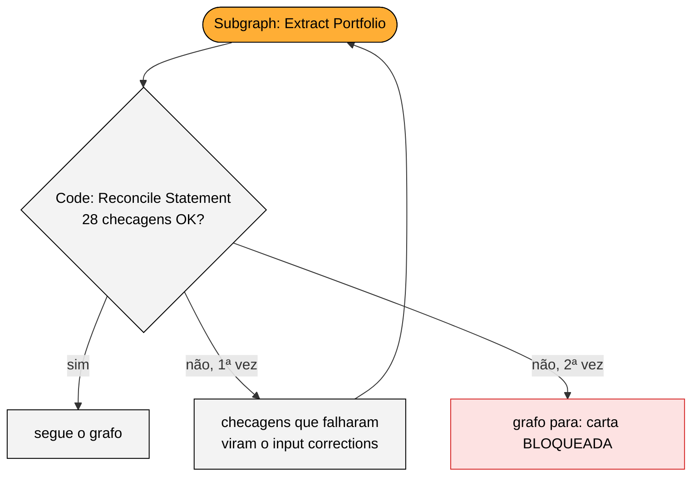
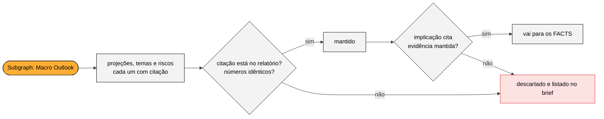
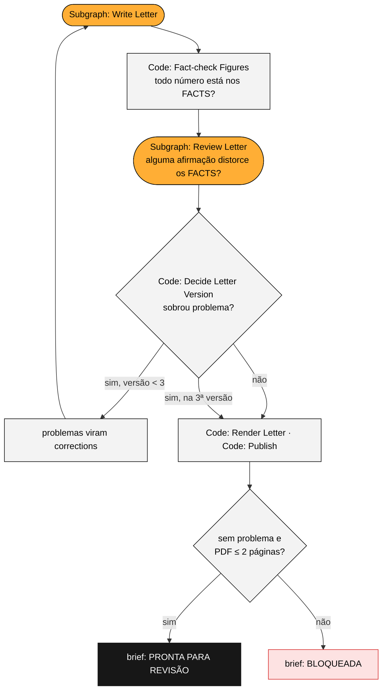

# Qualidade e travas

A pergunta que guiou a v2 foi: **"se o LLM errar aqui, quem percebe?"**. Cada trava abaixo responde isso para uma etapa. Todas surgiram ou foram calibradas com erros que apareceram de verdade nas execuções com a API. As provas estão em `data/evidence/`.

## 1. Reconciliação do extrato

**Etapa:** o LLM transcreve o PDF do extrato para JSON (**Subgraph: Extract Portfolio**), dentro do loop **Extraction Attempt**.

**Trava:** o node **Code: Reconcile Statement** (`lib/portfolio.js`) faz 28 checagens.
- investido + saldo = patrimônio;
- soma das classes = investido;
- soma das posições = subtotal de cada classe;
- quantidade × último preço = posição;
- aplicado × (1 + rentabilidade) = posição;
- % de alocação de cada posição.

Se alguma falhar, o loop roda de novo e o LLM recebe a lista de falhas; se falhar outra vez, o node **Code: Analyze Portfolio** para o grafo com o erro "Carta BLOQUEADA" e nenhuma carta é gerada.

**O que aconteceu de verdade:**
- O gpt-4.1-mini acertou os 180 campos das 12 posições, mas escreveu o subtotal de ações como **60.131,79** em vez de **60.311,79**. A reconciliação barrou.
- Na segunda tentativa, mesmo com o aviso, o mini repetiu o erro e ainda errou outro campo (evidências 01 e 02).
- Com o gpt-4.1, a transcrição bateu 100% com o gabarito feito à mão (`src/tests/fixtures/albert_statement.json`), por US$ 0,02.

**Lição:** o gabarito transformou "qual modelo usar?" numa decisão medida.

## 2. Ancoragem do macro

**Etapa:** o LLM resume o relatório de 11 páginas (**Subgraph: Macro Outlook**).

**Trava:** o node **Code: Check Macro Quotes** (`lib/grounding.js`) confere tudo contra o texto do relatório.
- Cada projeção, tema e risco precisa de uma **citação literal**, encontrada no texto como palavras em ordem, tolerando palavras quebradas pelo PDF, mas **nunca um número diferente**.
- O valor de cada projeção precisa estar dentro da citação.
- Os resumos só podem conter números que existem no relatório.

O que não passa é descartado e listado no brief.

**O que aconteceu de verdade:** o modelo "citou" a tabela de projeções com reticências ("SELIC … 15,50 … 2025"), e esses itens foram descartados (evidência 03). O prompt passou a proibir reticências e a pedir a linha inteira da tabela. Nas execuções de teste pelo Rivet, entre 20 e 24 itens foram mantidos e de 0 a 4 descartados por execução; os descartados são temas que colavam duas passagens diferentes.

## 3. Números da carta só dos FACTS

**Etapa:** o LLM escreve a carta (**Subgraph: Write Letter**), dentro do loop **Letter Attempt**.

**Trava:** o redator recebe o bloco FACTS, onde cada número já está formatado em pt-BR. O node **Code: Fact-check Figures** (`lib/factcheck.js`) extrai todo percentual, valor em R$ e p.p. da carta e exige que cada um exista **idêntico** nos FACTS.
- "R$ 40 mil" é rejeitado, porque o valor dos FACTS é "R$ 40.000,00".
- O mesmo vale para "3,5%" inventado.

Também confere a saudação ("Prezado Albert,"), proíbe listas e aponta palavras duplicadas. Nas execuções de teste, cada carta tinha de 20 a 29 números, e nenhum ficou sem fonte.

## 4. Revisor de fidelidade

**Etapa:** a mesma carta, agora quanto ao sentido do texto. O regex confere números, não sentido.

**Trava:** o **Subgraph: Review Letter** compara a carta com os FACTS e aponta como **grave** qualquer afirmação que:
- contradiga os FACTS;
- acrescente um status ou uma ação;
- tire uma condição;
- inverta uma projeção;
- altere um nome.

O node **Code: Decide Letter Version** junta esses apontamentos aos do fact-check e ao limite de palavras. Se sobrar algo, eles voltam ao redator como correções, em até três versões. Se ainda sobrar algo grave na terceira, a carta é gerada, mas sai **BLOQUEADA** no brief.

**O que aconteceu de verdade:** a primeira carta trocou "a Selic pode **parar de subir antes** se o câmbio estabilizar" por "possibilidade de **estabilização**". O revisor apontou a distorção (evidência 05), e a segunda versão corrigiu.

## 5. Fontes separadas: o que é da XP e o que é leitura nossa

**O problema:** o **Subgraph: Macro Outlook** devolve as projeções do relatório e também "implicações", que são a leitura do modelo sobre o relatório. Uma carta escreveu "a XP considera que a renda fixa pós-fixada segue atrativa para o perfil moderado". O relatório não diz isso; é uma inferência.

**A solução:** o prompt do redator passou a exigir que as projeções sejam atribuídas à XP e que as implicações apareçam como visão do assessor ("entendemos que…", "na nossa leitura…"), mantendo as ressalvas de cada uma ("pode", "tende a").

**O que aconteceu de verdade:** a primeira tentativa foi deixar o revisor mais rígido com as fontes. Ele passou a apontar como erro até "a XP projeta" e cada "deve" das projeções, e bloqueou 2 de 4 cartas corretas. A regra do revisor voltou ao texto original, com uma exceção explícita para "deve", "tende a" e "projeta", e a correção ficou no prompt do redator. Nas 3 execuções seguintes, as 3 cartas saíram prontas, duas já na primeira versão.

**Lição:** um revisor mais rígido não é um revisor melhor. A mudança só foi aceita depois de medida em execuções reais.

## 6. Frases sensíveis são escritas pelo código

**O problema:** algumas frases não podem ser parafraseadas.

**O que aconteceu de verdade:** a nota "o CDB venceu; **após confirmarmos a liquidação**, esses recursos entram na reaplicação" virou "recursos **já liquidados**" (evidência 04). Isso é uma afirmação que o assessor ainda não confirmou.

**A solução:** notas operacionais são impressas pelo node **Code: Render Letter**, abaixo da tabela de sugestões, com o texto exato. Na mesma versão, "Riza Lotus Plus Plus" levou a duas mudanças:
- os FACTS passaram a usar os nomes curtos dos fundos;
- o fact-check passou a apontar palavras repetidas.

## 7. Valores definidos por regra, não pelo LLM

O **Subgraph: Advise** só escolhe entre os candidatos que o node **Code: Analyze Portfolio** já calculou, com valor e regra. Um id que não existe é descartado pelo node **Code: Build FACTS**. O LLM justifica; ele não dimensiona.

## 8. O assessor no loop

O brief (`Output/brief_assessor_*.md`) é o que o assessor lê antes de enviar:
- o status da carta;
- o resultado de cada trava;
- os 11 alertas de dados;
- a rentabilidade por ativo, com a fonte de cada número;
- a alocação contra o perfil;
- cada recomendação com as citações do research que a sustentam;
- a estimativa de IR;
- o custo de cada chamada ao LLM.

O ganho de produtividade vem daqui: o assessor **revisa** em minutos em vez de escrever do zero. Nesta versão, um ajuste no texto é feito no HTML da carta ou pedindo uma nova execução; uma tela de revisão, onde o assessor aprova e edita, é um dos próximos passos.

## Testes automatizados

São 8 testes em `src/tests/`, com o executor de testes que já vem no Node (`node:test`). Rodam em cerca de 1 segundo e sem chave de API: `npm test`.

**Como funcionam:** o `harness.mjs` pega o código de um node exatamente como ele vai para o projeto (a mesma `assembleCode()` do build) e o executa com os mesmos parâmetros que o executor Node do Rivet passa. As respostas do LLM vêm de arquivos em `src/tests/fixtures/`, gravados de execuções reais. O parâmetro `require` não é passado, como no app desktop, então um uso esquecido falha no teste.

| Teste | O que confere |
|---|---|
| PDF do extrato vira uma linha por posição | A leitura do PDF mantém cada linha de tabela inteira |
| Extrato do gabarito reconcilia, e um subtotal trocado é pego | A reconciliação aprova o gabarito e barra o dígito trocado do gpt-4.1-mini |
| Rentabilidade do período igual à versão Python | Ações +R$ 1.925,97, carteira +2,51% / +R$ 6.650,04, CDI +1,00% |
| Candidatos, IR e alertas iguais à versão Python | R$ 40 mil + 40 mil + 27 mil, o saldo de IR (−R$ 13.345,11) e os 11 alertas |
| Citações do macro conferidas como na versão Python | Com a mesma resposta do LLM, 23 itens mantidos e o mesmo descartado |
| FACTS idêntico ao gerado pela versão Python | O bloco inteiro de números da carta, campo a campo |
| Fact-check aprova a carta final e pega número inventado | A carta real passa; o "0,2 p.p. abaixo do benchmark" da v1, plantado no texto, é pego |
| Carta em HTML traz a identidade da XP e os números | Logo embutido, patrimônio, a nota do CDB escrita pelo código e exatamente duas folhas |

Hoje ninguém roda os testes automaticamente: eles são executados à mão, antes de cada commit. Colocá-los num CI (por exemplo, GitHub Actions a cada push) é simples, porque não precisam de chave nem de rede.
