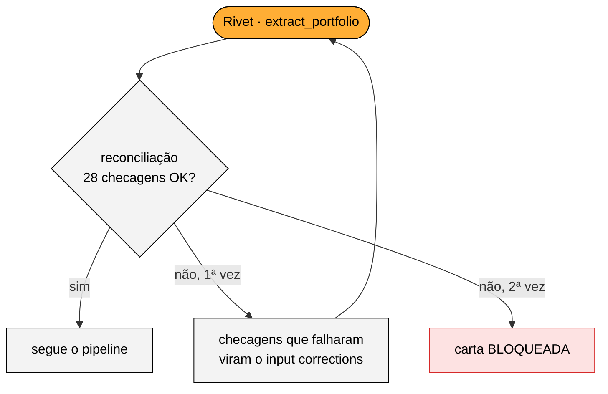
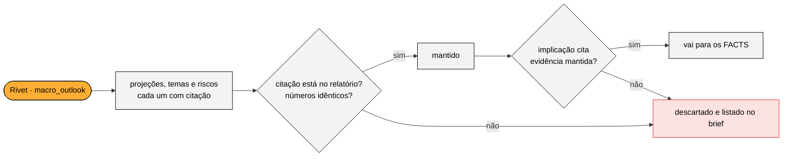
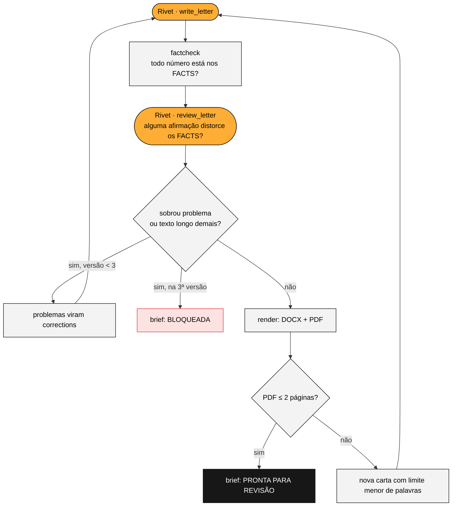

# Qualidade e travas

A pergunta que guiou a v2 foi: **"se o LLM errar aqui, quem percebe?"**. Cada trava abaixo responde isso para uma etapa. Todas surgiram ou foram calibradas com erros que apareceram de verdade nas execuções com a API. As provas estão em `data/evidence/`.

## 1. Reconciliação do extrato

**Etapa:** o LLM transcreve o PDF do extrato para JSON (`extract_portfolio`).

**Trava:** `portfolio.reconcile` faz 28 checagens.
- investido + saldo = patrimônio;
- soma das classes = investido;
- soma das posições = subtotal de cada classe;
- quantidade × último preço = posição;
- aplicado × (1 + rentabilidade) = posição;
- % de alocação de cada posição.

Se alguma falhar, o grafo roda de novo recebendo a lista de falhas; se falhar outra vez, a carta é bloqueada.

**O que aconteceu de verdade:**
- O gpt-4.1-mini acertou os 180 campos das 12 posições, mas escreveu o subtotal de ações como **60.131,79** em vez de **60.311,79**. A reconciliação barrou.
- Na segunda tentativa, mesmo com o aviso, o mini repetiu o erro e ainda errou outro campo (evidências 01 e 02).
- Com o gpt-4.1, a transcrição bateu 100% com o gabarito feito à mão (`src/tests/fixtures/albert_statement.json`), por US$ 0,02.

**Lição:** o gabarito transformou "qual modelo usar?" numa decisão medida.

## 2. Ancoragem do macro

**Etapa:** o LLM resume o relatório de 11 páginas (`macro_outlook`), uma vez por mês, e o resultado é compartilhado por todos os clientes.

**Trava:** `grounding.py` confere tudo contra o texto do relatório.
- Cada projeção, tema e risco precisa de uma **citação literal**, encontrada no texto como palavras em ordem, tolerando palavras quebradas pelo PDF, mas **nunca um número diferente**.
- O valor de cada projeção precisa estar dentro da citação.
- Os resumos só podem conter números que existem no relatório.

O que não passa é descartado e listado no brief.

**O que aconteceu de verdade:** o modelo "citou" a tabela de projeções com reticências ("SELIC … 15,50 … 2025"), e esses itens foram descartados (evidência 03). O prompt passou a proibir reticências e a pedir a linha inteira da tabela. Na versão final: **23 itens mantidos e 1 descartado**, um tema que colava duas passagens diferentes.

## 3. Números da carta só dos FACTS

**Etapa:** o LLM escreve a carta (`write_letter`).

**Trava:** o redator recebe o bloco FACTS, onde cada número já está formatado em pt-BR. `factcheck.py` extrai todo percentual, valor em R$ e p.p. da carta e exige que cada um exista **idêntico** nos FACTS.
- "R$ 40 mil" é rejeitado, porque o valor dos FACTS é "R$ 40.000,00".
- O mesmo vale para "3,5%" inventado.

Também confere a saudação ("Prezado Albert,"), proíbe listas e aponta palavras duplicadas.

**Na versão final:** 26 números conferidos, nenhum sem fonte.

## 4. Revisor de fidelidade

**Etapa:** a mesma carta, agora quanto ao sentido do texto. O regex confere números, não sentido.

**Trava:** um sexto grafo (`review_letter`) compara a carta com os FACTS e aponta como **grave** qualquer afirmação que:
- contradiga os FACTS;
- acrescente um status ou uma ação;
- tire uma condição;
- inverta uma projeção;
- altere um nome.

Os apontamentos voltam para o redator junto com os do fact-check, em até três versões. Se sobrar algo grave, a carta é bloqueada.

**O que aconteceu de verdade:** a primeira carta trocou "a Selic pode **parar de subir antes** se o câmbio estabilizar" por "possibilidade de **estabilização**". O revisor apontou a distorção (evidência 05), e a segunda versão corrigiu.

## 5. Frases sensíveis são escritas pelo código

**O problema:** algumas frases não podem ser parafraseadas.

**O que aconteceu de verdade:** a nota "o CDB venceu; **após confirmarmos a liquidação**, esses recursos entram na reaplicação" virou "recursos **já liquidados**" (evidência 04). Isso é uma afirmação que o assessor ainda não confirmou.

**A solução:** notas operacionais passaram a ser impressas por `render.py`, abaixo da tabela de sugestões, com o texto exato. Na mesma versão, "Riza Lotus Plus Plus" levou a duas mudanças:
- os FACTS passaram a usar os nomes curtos dos fundos;
- o fact-check passou a apontar palavras repetidas.

## 6. Valores definidos por regra, não pelo LLM

O grafo `advise` só escolhe entre os candidatos que `suitability.py` já calculou, com valor e regra. Um id que não existe é descartado pelo código. O LLM justifica; ele não dimensiona.

## 7. O assessor no loop

O brief (`Output/brief_assessor_*.md`) é o que o assessor lê antes de enviar:
- o status da carta;
- o resultado de cada trava;
- os 11 alertas de dados;
- a rentabilidade por ativo, com a fonte de cada número;
- a alocação contra o perfil;
- cada recomendação com as citações do research que a sustentam;
- a estimativa de IR;
- o custo de cada etapa.

A carta é salva também em DOCX, para ajustes. O ganho de produtividade vem daqui: o assessor **revisa** em minutos em vez de escrever do zero.

## Testes automatizados

São 29 testes em `src/tests/`, que rodam em cerca de 5 segundos e sem chave de API. Eles cobrem:
- formatação;
- reconciliação (inclusive dígito trocado);
- rentabilidade (+3,30% / +R$ 1.925,97);
- motor de recomendação e IR;
- fact-check (benchmark inventado, valor arredondado, nome duplicado, cliente errado);
- ancoragem (palavra quebrada no PDF aceita, número alterado rejeitado).

Há também um teste de ponta a ponta, com os grafos simulados, que exercita as duas rodadas de correção.
